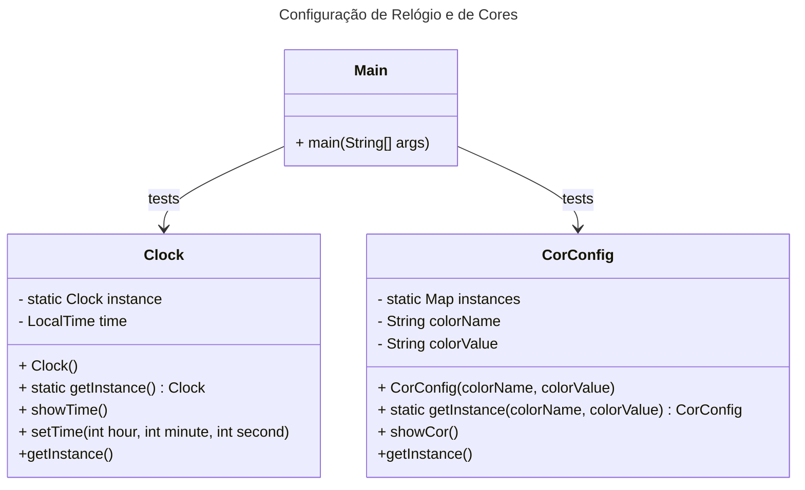

## Motivação

Imagine que você tem um sistema onde precisa gerenciar um "relógio de sistema" e também "configurações de cores" para uma interface. O padrão Singleton vai garantir que exista apenas um único "relógio" compartilhado em todo o sistema. Já o padrão Multiton vai garantir que existam instâncias únicas para as configurações de "cores" para diferentes partes do sistema, como a "cor do fundo" e a "cor do texto".

## Estrutura

## Participantes
Clock (Singleton): Representa um relógio único no sistema. Ou seja, só pode existir uma única instância de relógio no sistema.
CorConfig (Multiton): Gerencia configurações de cor específicas, como "background" ou "text".

### Explicação

- Um relógio único, representado pelo padrão Singleton, para garantir que todos os módulos da aplicação compartilhem a mesma hora.

- Configurações de cor, representadas pelo padrão Multiton, onde cada configuração de cor (como a cor de fundo ou a cor do texto) tem sua instância única, mas diferentes tipos de configurações não compartilham a mesma instância.